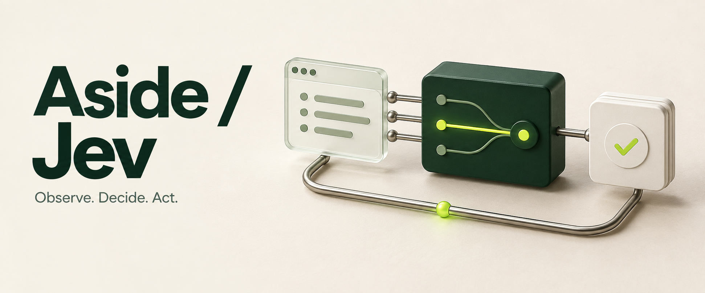
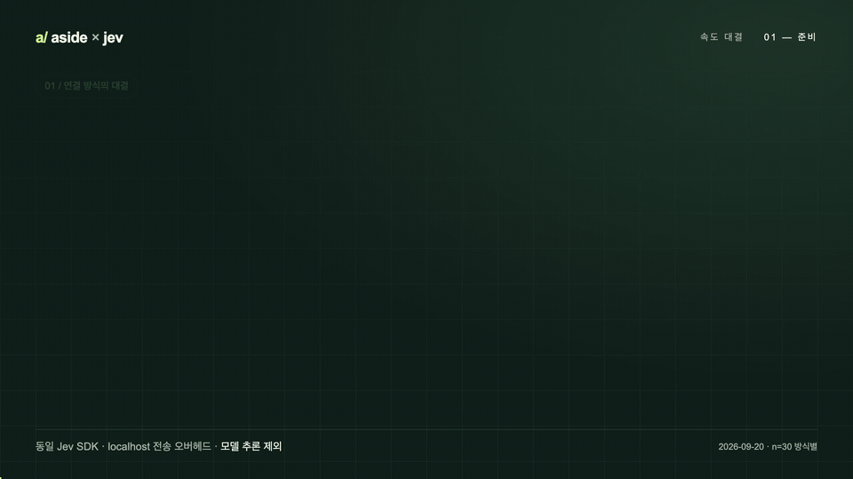
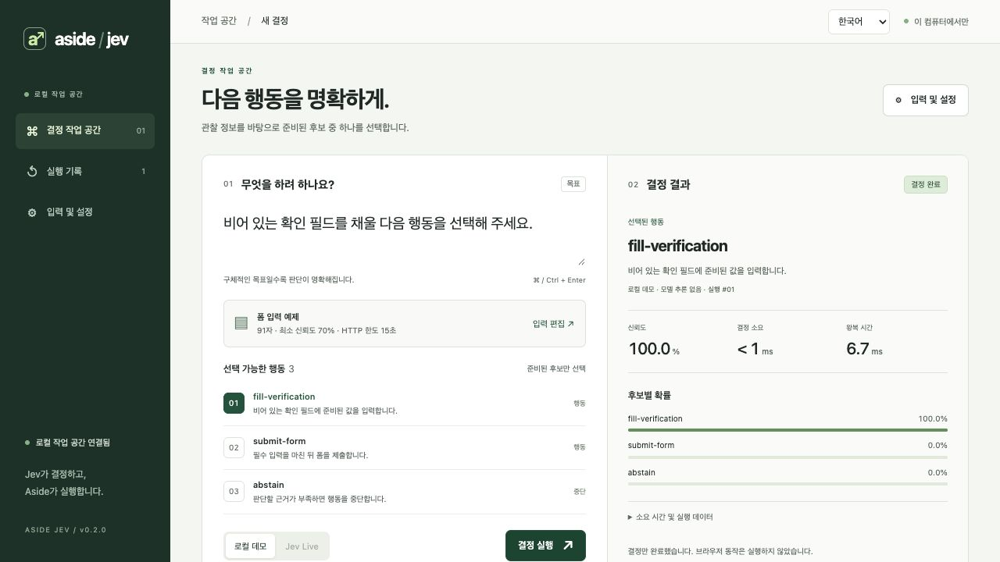
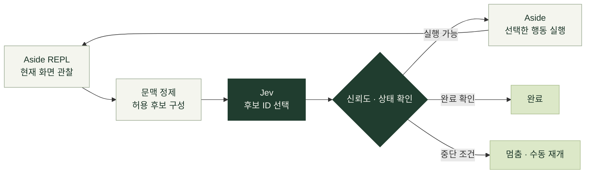

[English](README.md) | **한국어**

<p align="center">
  
</p>

<h1 align="center">브라우저의 다음 한 수, Jev.</h1>

<p align="center">
  Aside가 화면을 읽고 실행합니다.<br />
  <strong>Jev는 준비된 후보 중 다음 행동을 선택합니다.</strong>
</p>

<p align="center">
  <a href="pyproject.toml"></a>
  <a href="#mcp-tools"></a>
  <a href="extension/manifest.json"></a>
  <a href="LICENSE"></a>
</p>

<p align="center">
  <a href="#quick-start">빠른 시작</a> ·
  <a href="#the-loop">동작 방식</a> ·
  <a href="#speed-duel">속도 대결</a> ·
  <a href="#performance">레이턴시</a> ·
  <a href="docs/EXTENSION.ko.md">확장 설치</a> ·
  <a href="docs/VALIDATION.ko.md">검증 기록</a>
</p>

---

**Aside Jev**는 [Aside](https://aside.com)의 REPL과 [TypeSafe Jev](https://docs.typesafe.ai/introduction)를 연결하는 브라우저 작업 도구입니다. 툴바 팝업의 ON/OFF, 지속 REPL 세션, 정해진 후보 안에서의 선택을 하나의 흐름으로 연결합니다.

> **현재: 0.2.0 소스 프리뷰 · 릴리즈 전**<br />
> ON은 선택한 Aside 계정의 **새 작업 지침과 확장 전용 MCP**에 적용됩니다. `jev_browser_run`의 행동 선택은 Jev를 거치며, Aside 내장 도구 전체를 강제로 가로채는 기능은 제공하지 않습니다.

<a id="speed-duel"></a>

## 같은 Jev, 두 방식의 레이스

**요청마다 SDK 생성 vs 연결 재사용.** 같은 시간 배율로 달리고, p50·p95·TCP 연결 수로 결과를 확인합니다.

<p align="center">
  <a href="docs/media/jev-speed-duel.ko.mp4">
    
  </a>
</p>

<p align="center">
  <a href="docs/media/jev-speed-duel.ko.mp4">20초 영상 · 1080p MP4</a> ·
  <a href="docs/media/jev-speed-duel.ko-poster.png">정지 화면</a> ·
  <a href="video/README.ko.md">Remotion 소스와 재현 방법</a>
</p>

> **비교 범위:** 두 방식 모두 Jev SDK를 사용하는 **localhost 전송 벤치마크**입니다. 실제 Aside 기본 모델과 Jev의 브라우저 작업 속도 비교는 아직 측정하지 않았습니다. 영상은 실측 p50을 확대한 시각화이며 화면 녹화가 아닙니다. [측정 조건과 한계](docs/VALIDATION.ko.md#latency)

대시보드와 확장 팝업은 **영어가 기본**입니다. `English / 한국어` 메뉴에서 한국어를 선택하면 해당 화면에 저장됩니다. [다국어 구조](docs/I18N.ko.md)

## 작은 후보, 명확한 실행

| 판단은 좁게 | 실행은 정확하게 | 상태는 분명하게 |
| :--- | :--- | :--- |
| 목표와 관련된 관찰을 정제하고, 허용된 후보를 Jev에 전달합니다. | 현재 화면에서 확인한 대상만 사용하고, 실행 직전에 다시 관찰합니다. | ON/OFF·연결 상태·신뢰도·소요 시간을 확인할 수 있습니다. |
| 코드·선택자·입력값을 모델이 새로 만들지 않습니다. | 반복·무진행·오래된 관찰을 감지하면 멈춥니다. | 오류가 나도 다른 모델로 조용히 전환하지 않습니다. |

<a id="workspace"></a>

## 판단 과정을 한눈에

<p align="center">
  
</p>

<p align="center"><sub>실제 로컬 UI의 데모 모드 화면입니다. 후보 결정과 계측을 보여주며, 이 화면에서 브라우저 행동을 자동 실행하지 않습니다.</sub></p>

후보와 목표는 메인 화면에, 긴 관찰 데이터와 모델 설정은 별도 설정에 둡니다. 결정 결과에는 후보별 확률, 결정 소요 시간, 왕복 시간과 최근 20개 세션 기록이 표시됩니다.

<a id="the-loop"></a>

## 한 번의 연결, 이어지는 판단



한 작업 동안 하나의 Aside MCP/REPL 세션을 유지합니다. 화면이 바뀔 때마다 관찰과 후보를 갱신하며, **Jev가 선택한 유효한 후보만 실행**합니다. 완료 문구와 선택적 URL 조건은 로컬에서 확인하고, Jev가 `finish`를 선택한 뒤 화면을 재확인합니다.

| 상황 | 처리 |
| :--- | :--- |
| 같은 화면·행동 반복 또는 화면 순환 | 루프 중단 |
| 실행 후 관찰상 변화 없음 | `no_progress`로 중단 |
| 결정 후 화면 변경 | 오래된 후보를 실행하지 않음 |
| 낮은 신뢰도·알 수 없는 ID·Jev 오류 | 실행 중단, 자동 fallback 없음 |
| 단계·시간 예산 소진 | 상태를 반환하고 수동 재개 |
| 판단 중 OFF 또는 신뢰도 기준 상향 | 실행 전에 최신 정책 재확인 |

<a id="quick-start"></a>

## 간단하게 설치하기

**Windows·macOS 지원 · Git, Python, uv를 미리 설치할 필요가 없습니다.** 먼저 [Aside](https://aside.com/download)를 설치하고 로그인하세요.

1. **[ZIP 다운로드](https://github.com/himomohi/aside-jev/archive/refs/heads/main.zip)** 후 압축을 풉니다.
2. Windows는 **`Install.cmd`**, macOS는 **`Install.command`**를 실행합니다. Aside 계정을 선택하고 Jev 키를 입력한 뒤 변경 내용을 확인해 적용합니다.
3. Aside 다시 열기 → 확장 관리 → 개발자 모드 → **압축해제된 확장 로드**에서 설치기가 표시한 폴더를 선택합니다. **Aside Jev**를 고정하고 **ON**으로 켠 뒤 새 작업을 시작하세요.

설치기가 전용 Python 환경을 준비하고, 확장을 고정 폴더에 복사하며, 기존 설정을 보존해 Jev MCP 연결을 추가합니다. PC마다 확장 ID를 복사할 필요가 없습니다. **설치 적용 전에는 Aside를 종료**해 계정 설정이 동시에 덮어써지는 것을 방지하세요.

> Windows Native Messaging은 해당 Aside 빌드의 등록 키가 필요합니다. 기존 Aside `NativeMessagingHosts` 경로를 찾으면 제안하고, 없으면 확인된 키를 입력받습니다. Windows 실기기의 최종 브라우저 연결은 아직 검증하지 않았습니다. [Windows 상세 안내 →](docs/EXTENSION.ko.md#windows)

macOS에서 다운로드한 `.command`가 열리지 않으면 압축을 푼 폴더에서 `bash scripts/install.sh`를 실행하세요. OS 보안 검사를 해제할 필요가 없습니다. 설치 문구는 영어가 기본이며 `.\Install.cmd --lang ko` 또는 `bash scripts/install.sh --lang ko`로 한국어를 선택합니다.

[**설치 상세·업데이트·제거 →**](docs/EXTENSION.ko.md)

<details>
<summary><strong>개발자 시작 / API 키 없이 체험</strong></summary>

```bash
uv sync
uv run aside-jev setup --dry-run
uv run aside-jev dashboard --open
```

로컬 데모 주소는 `http://127.0.0.1:8766`입니다. 빈 포트를 사용하려면 `--port 0`을 추가하세요. Python/uv가 있다면 `uv run aside-jev setup`으로 연결 설치만 진행할 수 있습니다.

</details>

**macOS 설치기는 API 키를 평문 파일 대신 macOS 키체인에 저장합니다.** 숨김 입력과 `--env-file` 가져오기를 지원하며 Windows는 기존 환경 파일 방식을 유지합니다. 키는 팝업으로 전달하지 않고, 키 존재 확인은 실제 인증 성공을 뜻하지 않습니다. [키체인 이전·교체·삭제 안내](docs/KEYCHAIN.ko.md)를 참고하세요.

<details>
<summary><strong>MCP만 연결해서 사용하기</strong></summary>

일반 결정 도구는 stdio 서버로 실행할 수 있습니다.

```bash
uv run aside-jev serve
```

팝업의 ON/OFF와 Live 전용 정책을 적용하려면 설치된 전용 wrapper 또는 아래 명령을 사용합니다. 확장 연결 설정이 먼저 필요합니다.

```bash
uv run aside-jev serve --extension
```

`./scripts/install.sh`는 Python 패키지만 설치합니다. 계정 지침·Native Messaging·MCP 연결은 [별도 설치 과정](docs/EXTENSION.ko.md)에서 적용합니다.

</details>

<details>
<summary><strong>브라우저 루프 호출 예제</strong></summary>

Aside에서 이미 열린 탭의 `targetId`를 확인한 뒤 `jev_browser_run`에 전달합니다.

```json
{
  "goal": "Continue를 따라가 Journey complete 화면까지 이동",
  "target_id": "현재 Aside 탭의 targetId",
  "action_rules": [
    {"role": "link", "name": "Continue", "action": "click"}
  ],
  "completion_text": "Journey complete",
  "max_steps": 12,
  "total_timeout_s": 90,
  "min_confidence": 0.7
}
```

- 지원 동작: `click`, `focus`, `fill`. `fill`은 명시한 `value`만 사용합니다.
- 행동 규칙: 사용자가 허용한 범위의 **정확한 접근성 이름**을 지정합니다. 대상이 중복되거나 없으면 멈춥니다.
- 완료 조건: 성공을 구별할 수 있는 고유한 `completion_text`를 지정합니다. `completion_url`을 추가하면 정확한 URL도 검사합니다.
- 기본 예산: 12단계·전체 90초. 별도 승인이 필요한 동작은 승인 없이 후보에 추가하지 않습니다.

</details>

<a id="performance"></a>

## 연결을 재사용해 대기를 줄입니다

SDK 클라이언트와 HTTP 연결을 재사용하고, MCP 결정 요청은 이벤트 루프 밖에서 처리합니다. 자동 재시도는 제거하고 요청·작업별 한도를 둡니다.

**로컬 SDK 전송 벤치마크 · 30회 · 2026-09-20**

| 측정 | 매 요청 클라이언트 생성 | 연결 재사용 |
| :--- | ---: | ---: |
| p50 | 1.157ms | **0.540ms** |
| p95 | 1.695ms | **0.747ms** |
| TCP 연결 수 | 30 | **1** |

이 환경에서 전송 경로의 p50 오버헤드가 약 **53.3% 감소**했습니다. localhost의 SDK 전송을 측정한 결과이며, 실제 Jev 추론 속도 개선율을 뜻하지 않습니다. HTTP 기본 15초는 연결·읽기·쓰기·풀 대기 **각 단계의 timeout**입니다.

[측정 방법과 검증 범위 →](docs/VALIDATION.ko.md)

<a id="mcp-tools"></a>

## 작은 도구 모음

| 도구 | 역할 |
| :--- | :--- |
| **`jev_browser_run`** | 지속 REPL 세션에서 관찰 → Jev 선택 → 실행 → 검증 |
| `jev_extension_status` | 확장 ON/OFF와 연결 준비 상태 조회 |
| `jev_system_one` | Choice / Score / Noul 형식의 일반 Jev 질문 |
| `jev_choose` | 앱이 제공한 후보 중 한 ID 선택 |
| `jev_step` | 후보 선택·신뢰도 검사 후 실행 payload 반환 |
| `jev_validate` | ID가 제공된 후보에 있는지 로컬 검증 |

일반 MCP/CLI의 `jev_choose`·`jev_step`은 테스트용 `mock`을 지원합니다. **확장 전용 MCP와 `jev_browser_run`은 Live 전용**입니다.

## 검증으로 구분하는 현재 상태

| 확인한 것 | 아직 확인하지 않은 것 |
| :--- | :--- |
| Python 152개 + JavaScript 20개 테스트 통과 기록 | 실제 Jev API 인증·판단 품질·추론 시간 |
| 실제 Aside에서 로컬 페이지 6회 이동·완료 확인 — **판단은 fixture stub** | 일반 웹사이트 전반의 작업 성공률 |
| 임시 프로필에서 Native Messaging·ON/OFF·백업/복구 | 실제 사용자 계정의 확장 설치·MCP 연결 |
| 로컬 UI의 데모 결정·입력 오류·390px 화면 | Aside 내장 직접 도구 전체의 강제 라우팅 |

<details>
<summary><strong>실행 전에 알아둘 경계</strong></summary>

- OFF는 선택한 프로필의 관리 구간을 해제합니다. 상태 확인용 스킬 파일은 유지됩니다.
- OFF·시간 초과는 이미 전송된 브라우저 행동을 되돌리지 않습니다. `execution_state: unconfirmed`이면 화면을 확인한 뒤 수동으로 재개합니다.
- 성공 조건과 행동 규칙은 작업에 맞게 지정해야 합니다. 모든 사이트를 다루는 범용 자동화로 검증된 것은 아닙니다.
- 문맥 정제는 크기 제한과 자격증명 패턴 가림을 제공합니다. 임의의 개인정보·비밀값을 모두 식별하는 기능은 아닙니다.
- 상단 배너는 생성한 콘셉트 일러스트입니다. 실제 제품 화면과 실행 근거는 [검증 기록](docs/VALIDATION.ko.md)에 따로 표시합니다.

</details>

## 개발하기

```bash
uv sync --extra dev
uv run pytest -q
node --test tests/test_extension_controller.mjs
uv run python scripts/benchmark_latency.py --samples 30

# 실제 Aside에서 localhost 테스트 탭을 열고 6회 이동 후 닫음
# Jev API 호출 없이 브라우저 실행 경로만 검증
uv run python scripts/verify_browser_runtime.py
```

| 읽을거리 | 내용 |
| :--- | :--- |
| [확장 설치](docs/EXTENSION.ko.md) | 로컬 연결, 계정 설정, ON/OFF, 비활성화 |
| [기능 맵](docs/FEATURE_MAP.ko.md) | 기능별 진입점, 구현 파일, 검증 명령 |
| [검증 기록](docs/VALIDATION.ko.md) | 테스트, 실제 실행, 측정 결과와 한계 |
| [변경 기록](CHANGELOG.ko.md) | 버전별 변경 사항 |

---

<p align="center">
  <a href="https://docs.aside.com/help/developers">Aside 개발 인터페이스</a> ·
  <a href="https://docs.typesafe.ai/sdk/python">TypeSafe SDK</a> ·
  <a href="LICENSE">MIT License</a><br />
  <sub>명확한 후보. 확인할 수 있는 결정. 제어할 수 있는 실행.</sub>
</p>
