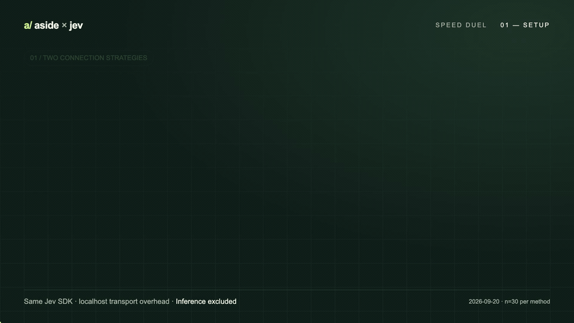
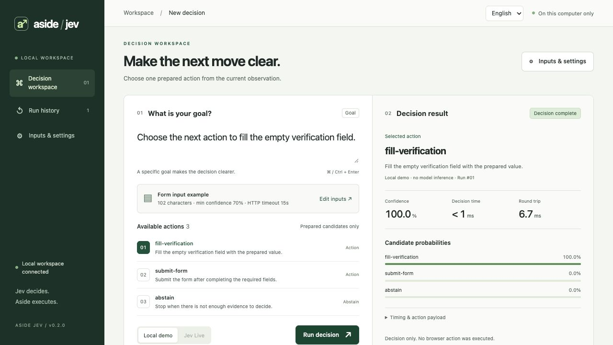
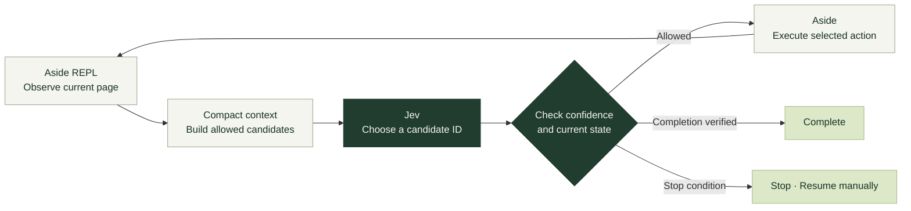

[**English**](README.md) | [한국어](README.ko.md)

<p align="center">
  
</p>

<h1 align="center">Your browser's next move. Chosen by Jev.</h1>

<p align="center">
  Aside observes the page and executes.<br />
  <strong>Jev picks the next action from your defined candidates.</strong>
</p>

<p align="center">
  <a href="pyproject.toml"></a>
  <a href="#mcp-tools"></a>
  <a href="extension/manifest.json"></a>
  <a href="LICENSE"></a>
</p>

<p align="center">
  <a href="#quick-start">Quick start</a> ·
  <a href="#the-loop">How it works</a> ·
  <a href="#speed-duel">Speed duel</a> ·
  <a href="#performance">Latency</a> ·
  <a href="docs/EXTENSION.md">Install the extension</a> ·
  <a href="docs/VALIDATION.md">Validation</a>
</p>

---

**Aside Jev** connects the [Aside](https://aside.com) REPL with [TypeSafe Jev](https://docs.typesafe.ai/introduction). A toolbar toggle, a persistent REPL session, and bounded action selection work together in one browser workflow.

> **Current status: 0.2.0 source preview · not yet released**<br />
> ON applies to **new task instructions and the extension-specific MCP** for the selected Aside account. `jev_browser_run` delegates action selection to Jev. The extension does not intercept all built-in Aside tools.

<a id="speed-duel"></a>

## Same Jev. Two strategies. One race.

**New SDK client per request vs connection reuse.** Watch both lanes on the same time scale, then compare p50, p95, and TCP connections.

<p align="center">
  <a href="docs/media/jev-speed-duel.mp4">
    
  </a>
</p>

<p align="center">
  <a href="docs/media/jev-speed-duel.mp4">20-second video · 1080p MP4</a> ·
  <a href="docs/media/jev-speed-duel-poster.png">Still image</a> ·
  <a href="docs/media/jev-speed-duel.ko.mp4">한국어 영상</a> ·
  <a href="video/README.md">Remotion source & reproduction</a>
</p>

> **What this measures:** both methods use the same Jev SDK in a **localhost transport benchmark**. Actual browser task speed with the default Aside model versus Jev has not been measured. This animation expands measured p50 values; it is not a screen recording. [Method and limitations](docs/VALIDATION.md#latency)

The dashboard and extension popup **default to English**. Choose Korean in the `English / 한국어` menu; each surface remembers your selection. [Localization guide](docs/I18N.md)

## Small candidate sets. Clear execution.

| Bounded decisions | Grounded actions | Visible state |
| :--- | :--- | :--- |
| Compact the relevant observation and send only allowed candidates to Jev. | Use targets observed on the current page and check again before execution. | Inspect ON/OFF, connectivity, confidence, and timing. |
| The model does not invent code, selectors, or input values. | Stop on repetition, no progress, or stale observations. | Errors never silently switch to another model. |

<a id="workspace"></a>

## See the decision

<p align="center">
  
</p>

<p align="center"><sub>Actual local UI in demo mode. It displays candidate selection and timing; this screen does not automatically execute browser actions.</sub></p>

Keep the goal and candidates in the main workspace, with longer observations and model settings in a separate panel. Results show candidate probabilities, decision time, round-trip time, and the latest 20 records from the current session.

<a id="the-loop"></a>

## One connection. A continuous decision loop.



One Aside MCP/REPL session stays open throughout a task. Refresh observations and candidates when the page changes, and **execute only the valid candidate selected by Jev**. Completion text and an optional URL condition are checked locally; the page is checked again after Jev selects `finish`.

| Condition | Behavior |
| :--- | :--- |
| Repeated page/action or a page cycle | Stop the loop |
| No observable change after execution | Stop with `no_progress` |
| Page changes after the decision | Do not execute stale candidates |
| Low confidence, unknown ID, or Jev error | Stop without an automatic fallback |
| Step or time budget exhausted | Return state for manual resumption |
| OFF or a higher confidence threshold during selection | Recheck policy before execution |

<a id="quick-start"></a>

## Quick start

Requires **Python 3.11+ · uv · Aside CLI**. Run from this checkout:

```bash
uv sync
uv run aside-jev doctor --json
uv run aside-jev dashboard --open
```

Try a demo decision without an API key. The default address is `http://127.0.0.1:8766`; add `--port 0` to select an available port.

### From toolbar to ON

| 01 · Load | 02 · Connect locally | 03 · Register MCP & enable |
| :--- | :--- | :--- |
| Load [`extension/`](extension/) as an unpacked extension in Aside's extension manager. | Specify the extension ID, account profile, and Native Messaging directory; review the installation preview. | Register the popup's MCP configuration in Aside, turn ON, and start a **new task**. |

See the [**extension installation guide →**](docs/EXTENSION.md) for exact commands, key configuration, backups, and disabling. The installer previews changes by default.

Live decisions require `TYPESAFE_API_KEY` or `TYPESAFEAI_API_KEY`. The extension can also use an explicitly selected local key file. Raw keys are not entered or stored in the popup. Key presence is not proof of successful authentication.

<details>
<summary><strong>Use MCP without the popup</strong></summary>

Start the general decision tools over stdio:

```bash
uv run aside-jev serve
```

To enforce the popup's ON/OFF state and Live-only policy, use the installed wrapper or the following command after configuring the extension connection:

```bash
uv run aside-jev serve --extension
```

`./scripts/install.sh` only installs the Python package. Account instructions, Native Messaging, and MCP registration are part of the [separate installation process](docs/EXTENSION.md).

</details>

<details>
<summary><strong>Browser loop example</strong></summary>

Find the `targetId` of an already-open Aside tab and pass it to `jev_browser_run`:

```json
{
  "goal": "Follow Continue until the Journey complete page",
  "target_id": "targetId-of-the-current-Aside-tab",
  "action_rules": [
    {"role": "link", "name": "Continue", "action": "click"}
  ],
  "completion_text": "Journey complete",
  "max_steps": 12,
  "total_timeout_s": 90,
  "min_confidence": 0.7
}
```

- Supported actions: `click`, `focus`, `fill`. `fill` uses only the specified `value`.
- Rules: provide **exact accessible names** within the user's authorized scope. Missing or ambiguous targets stop execution.
- Completion: use distinctive `completion_text`. Add `completion_url` to require an exact URL match.
- Default budget: 12 steps and 90 seconds total. Actions requiring separate approval must be approved before being added as candidates.

</details>

<a id="performance"></a>

## Reuse connections. Reduce overhead.

Reuse the SDK client and HTTP connection, and process MCP decision requests outside the event loop. Automatic retries are disabled; requests and tasks have explicit limits.

**Local SDK transport benchmark · 30 requests per method · 2026-09-20**

| Metric | New client per request | Connection reuse |
| :--- | ---: | ---: |
| p50 | 1.157ms | **0.540ms** |
| p95 | 1.695ms | **0.747ms** |
| TCP connections | 30 | **1** |

Transport-path p50 overhead fell by approximately **53.3% in this environment**. This measures localhost SDK transport, not actual Jev inference speed. The default HTTP timeout of 15 seconds applies **separately to connect, read, write, and pool waits**.

[Measurement method and boundaries →](docs/VALIDATION.md)

<a id="mcp-tools"></a>

## A small toolset

| Tool | Purpose |
| :--- | :--- |
| **`jev_browser_run`** | Observe → Jev selection → execute → verify in a persistent REPL session |
| `jev_extension_status` | Inspect ON/OFF state and connection readiness |
| `jev_system_one` | General Jev questions using Choice / Score / Noul |
| `jev_choose` | Select one ID from app-owned candidates |
| `jev_step` | Select, check confidence, and return the execution payload |
| `jev_validate` | Locally verify that an ID belongs to the candidate set |

The general MCP/CLI `jev_choose` and `jev_step` support `mock` for testing. **The extension-specific MCP and `jev_browser_run` are Live-only.**

## What has been verified

| Verified locally | Not yet verified |
| :--- | :--- |
| Recorded Python and JavaScript regression checks | Live Jev authentication, decision quality, and inference latency |
| Six local page transitions and completion in actual Aside — **decisions supplied by a fixture stub** | Success rates across general websites |
| Native Messaging, ON/OFF, and backup/recovery in temporary profiles | Extension installation and MCP registration in a real user account |
| Local demo UI, input errors, and narrow-screen layout | Forced routing of all built-in Aside tools |

See [validation records](docs/VALIDATION.md) for exact check counts and localization evidence.

<details>
<summary><strong>Execution boundaries</strong></summary>

- OFF removes the managed instruction block from the selected profile. The status-check skill file remains.
- OFF and timeouts do not undo browser actions already sent. If `execution_state: unconfirmed`, inspect the page before resuming manually.
- Completion conditions and action rules are task-specific. This has not been validated as a universal browser agent.
- Context sanitization limits size and masks credential patterns. It does not identify every possible personal or secret value.
- The hero is generated concept artwork. Actual UI and execution evidence are identified in the [validation record](docs/VALIDATION.md).

</details>

## Development

```bash
uv sync --extra dev
uv run pytest -q
node --test tests/test_extension_controller.mjs
uv run python scripts/benchmark_latency.py --samples 30

# Verify six localhost transitions in actual Aside.
# This exercises browser execution without calling the Jev API.
uv run python scripts/verify_browser_runtime.py
```

| Read more | Contents |
| :--- | :--- |
| [Extension setup](docs/EXTENSION.md) | Local connection, account setup, ON/OFF, disabling |
| [Feature map](docs/FEATURE_MAP.md) | Entry points, source files, checks |
| [Validation](docs/VALIDATION.md) | Tests, runtime evidence, measurements, limits |
| [Localization](docs/I18N.md) | English defaults, Korean dictionaries, localized media |
| [Changelog](CHANGELOG.md) | Changes by version |

---

<p align="center">
  <a href="https://docs.aside.com/help/developers">Aside developer interface</a> ·
  <a href="https://docs.typesafe.ai/sdk/python">TypeSafe SDK</a> ·
  <a href="LICENSE">MIT License</a><br />
  <sub>Defined candidates. Inspectable decisions. Controlled execution.</sub>
</p>
