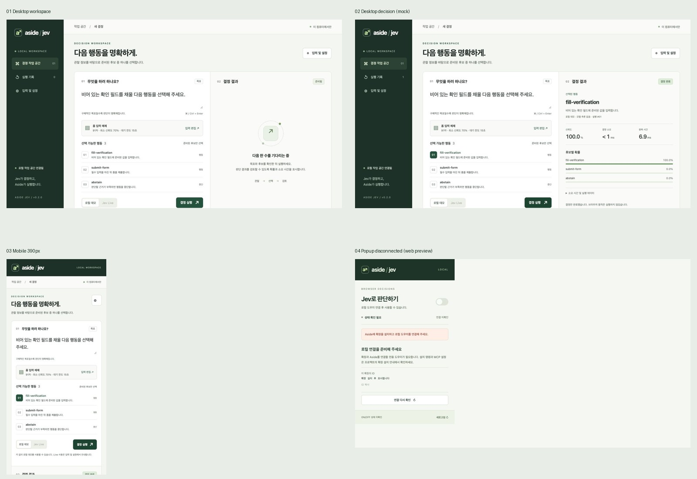
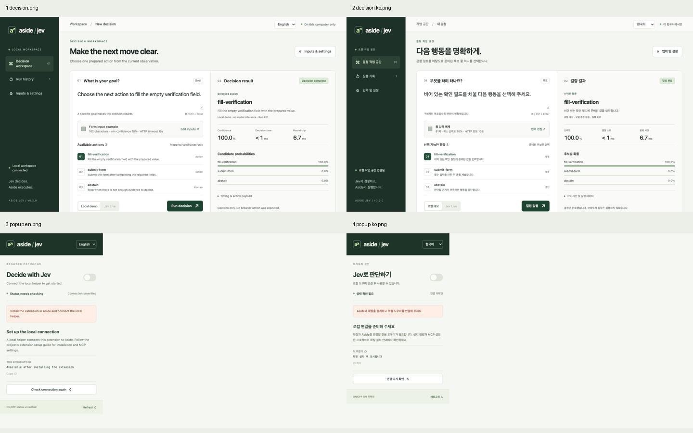

[English](VALIDATION.md) | **한국어**

# 검증 기록

검증일: 2026-09-20. 소스 프리뷰 0.2.0의 로컬 검증 기록입니다. 소스 게시는 패키지 릴리즈를 뜻하지 않습니다.

## 자동 검사

- Python 테스트: 146개. 후보 계약·저신뢰도·HTTP 연결 재사용·동시 요청·문맥 정제·로컬 UI 서버·Native Messaging·설치 백업/복구·브라우저 루프 경계를 포함합니다.
- JavaScript controller 테스트: 4개. 호스트 확인 전 ON 표시 금지, 중복 전환 방지, 실패 시 상태 미확인, 설정 저장·OFF 전환.
- `uv build`: wheel과 source distribution 생성. 실제 확장 로드나 계정 연결 성공을 의미하지 않습니다.
- 설치 shell 구문, Python 구문, 스킬 frontmatter, git diff 공백 검사.

브라우저 루프 회귀 항목: 6회 페이지 전환, 동일 페이지/행동 순환, ref만 변경된 무진행, 오래된 관찰, 단계·시간 예산, 정확한 완료 URL, 결정 중 OFF·신뢰도 상향, 모델 오류·잘못된 ID·abstain, 큰 페이지 후반의 관련 문구 보존, 문맥 집계 보존, 정제 후 후보 설명 충돌 차단. Aside 연결 초기화도 전체 시간 예산에 포함합니다.

## 실제 Aside 런타임

`uv run python scripts/verify_browser_runtime.py`로 실제 `aside mcp`의 지속 REPL 세션에서 localhost fixture 탭을 열었습니다. 링크 클릭 6회와 매번 새 관찰을 수행하고, 7번째 선택에서 완료 문구·정확한 URL을 확인했습니다. 작업 후 테스트 탭과 로컬 HTTP 서버를 종료했습니다.

첫 실행 결과: 브라우저 루프 3,124.27ms, 6회 실행, `verified`. **결정 함수는 fixture stub이며 실제 Jev API를 호출하지 않았습니다.** 이 값은 Jev 모델 품질·추론 레이턴시 또는 일반 웹사이트 성공률을 입증하지 않습니다.

Native Messaging은 임시 프로필·임시 등록 경로에서 설치 결과의 실제 wrapper 프로세스와 길이 접두 JSON 응답을 검증했습니다. 실제 사용자 Aside 프로필이나 브라우저 등록 파일은 변경하지 않았습니다.

## 레이턴시

`scripts/benchmark_latency.py --samples 30`은 실제 TypeSafe SDK를 localhost HTTP fixture에 연결합니다. fixture는 인위적 지연을 넣지 않았습니다.

| 방식 | p50 | p95 | TCP 연결 |
| --- | --- | --- | --- |
| 매 요청 SDK 클라이언트 생성 | 1.157ms | 1.695ms | 30 |
| 클라이언트·연결 재사용 | 0.540ms | 0.747ms | 1 |

이 환경에서 전송 경로의 p50 오버헤드가 약 53.3% 감소했습니다. 인터넷 왕복·TypeSafe 서버 처리·실제 모델 추론은 측정 범위 밖입니다. `timeout_s`는 각 HTTP 단계의 한도이며 SDK 자동 재시도는 0입니다.

측정 순서는 요청마다 생성 → 재사용이며, 각 방식 30회에 첫 연결을 포함합니다. 반복 시행·순서 무작위화·동시 부하는 적용하지 않았습니다. 기본 경로는 SDK 직접 호출, 재사용 경로는 `choose_live`의 검증·문맥 정제를 포함하므로 클라이언트 수명만 엄밀히 통제한 실험은 아닙니다. 기본 경로의 매회 종료 비용은 측정에 포함하고, 공유 클라이언트의 마지막 종료는 구간 밖입니다. 원시 요청별 표본은 보존하지 않았으며 영상은 위 집계값을 사용합니다.

## 속도 대결 영상

[Remotion 소스와 재현 방법](../video/README.ko.md) · [MP4](media/jev-speed-duel.ko.mp4) · [GIF](media/jev-speed-duel.ko.gif)

1920×1080, 30fps, 20초의 측정값 시각화입니다. 두 레인은 동일 환산식 `elapsedMs = (frame - 60) / 150 × 1.157`을 사용하고 각 p50에서 멈춥니다. p50 1.157ms를 화면의 5초로 확대해 연결 재사용 레인이 약 2.334초에 도착합니다. 실제 작업 녹화, 30회 요청의 총 실행 시간, Aside 기본 모델과 Jev의 추론 비교를 의미하지 않습니다.

영상 검증: TypeScript·ESLint 통과, 주요 프레임 시각 확인, H.264 디코딩 검사와 MP4 메타데이터(1080p·30fps·600프레임·20초) 확인. GIF는 960×540·240프레임·20초 반복입니다. Computer Use로 로컬 README의 GIF 표시와 MP4의 20초 끝까지 재생(오류 없음)을 확인했습니다. 로컬 문서 링크 35개와 렌더 프로세스 loopback 바인딩을 확인했습니다. GitHub 게시·원격 README 렌더링은 수행하지 않았습니다.

## UI 확인

Codex Computer Use로 최신 로컬 UI의 데모 결정, 결과·확률·구간별 소요 시간, JSON 입력 오류, 설정 취소, 390px 모바일 화면을 확인했습니다. Live 키가 없는 상태에서는 Live 선택이 비활성화됩니다. 최신 서버의 데모 왕복은 한 번의 관찰에서 6.9ms였습니다. 벤치마크나 Live 지연으로 해석하지 않습니다.

툴바 팝업 HTML은 localhost 미리보기로 연결 미확인 상태, 비활성 토글, 재연결 안내를 확인했습니다. 실제 확장 컨텍스트의 Native Messaging 연결은 아직 확인하지 않았습니다.

## 영어 기본·한국어 i18n 검증

- 다국어 적용 후 전체 회귀: **Python 152개, JavaScript 20개 통과**. 언어 저장·fallback·저장소 차단, 사전·placeholder 동일성, 접근성 라벨, 실제 UI 이벤트, 사용자 편집 입력 보존, 네이티브 계약 유지를 포함합니다.
- TypeScript·ESLint 통과. 양언어 영상의 H.264 디코딩·1080p·30fps·600프레임·20초를 확인했습니다. 각 GIF는 240프레임·20초이며 대표 프레임을 함께 검토했습니다.
- Computer Use로 최초 영어 화면, 한국어 전환과 새로고침 유지, 결과·오류 표시 번역, 직접 수정한 목표의 전환 중 보존을 확인했습니다. 팝업은 localhost HTML의 호스트 미연결 상태에서 검증했으며 실제 확장 등록은 아닙니다.
- 언어별 README의 GIF 표시와 실제 데모 UI 스크린샷을 확인했습니다. 390px 영문 화면에서 언어 메뉴·라벨의 가로 넘침이 없고 임시 뷰포트는 복원했습니다.
- 문서 언어별 산출물·로컬 링크 검사 통과, wheel·source distribution 재생성 및 번역 모듈 포함을 확인했습니다.
- CLI 자체 문구는 영어 기본이며 `--lang ko`를 지원합니다. 백엔드·provider 원문 진단 및 생성하는 에이전트 지침은 번역 범위 밖입니다. [상세 경계](I18N.ko.md)

## Windows·macOS 간편 설치

- 설치기 변경 후 로컬 전체 검사: **Python 215개 통과, Windows 전용 통합 1개 미실행; JavaScript 20개 통과**. 개발 중 복제 번역 사전의 신규 문구 누락이 감지됐고 두 사전을 맞춘 뒤 JavaScript 검사를 통과했습니다.
- macOS에서 PATH에 uv가 없는 임시 환경으로 실제 초기 설치를 실행했습니다. uv 0.12.17을 내려받아 SHA-256을 확인하고 Python 3.11.16 및 패키지를 준비했습니다. 이후 재설치는 lockfile 의존성·해시 검증과 한국어 설치 안내로 완료했습니다.
- 공백·한글이 포함된 가상 계정 경로를 사용했습니다. 기존 설정과 다른 MCP 보존, 설치 취소, 미리보기, 재설치, 키 비노출, 설정 동시 변경, 소유권 충돌, 원복을 검증했습니다. 실제 사용자 계정 파일은 변경하지 않았습니다.
- 설치된 native-host 실행 파일에 고정 확장 origin으로 메시지를 보내 정상 프레임 응답·MCP 설정 인식·OFF 유지 상태를 확인했습니다. 로컬 프로세스 계약의 증거이며 실제 브라우저 연결 증거는 아닙니다.
- Windows 레지스트리 소유권·뷰 충돌과 실패 복구는 fake registry로 검증했습니다. Windows용 Python 진입점도 macOS에서 실제 자식 프로세스로 실행했습니다. 실제 Windows 파일 핸들·배치 실행·ACL·Aside 브라우저 등록은 Windows 실행 전까지 미검증입니다.
- wheel에 설치기와 확장 언어 파일을 포함했습니다. 확장 공개키로 폴더 위치와 관계없이 같은 ID를 계산하며 개인 서명키는 배포하지 않습니다.

## 남은 경계

- 실제 Jev API 인증·판단 품질·추론 시간은 미검증입니다.
- 실제 Aside 확장 설치, Native Messaging 등록 폴더, MCP 설정 적용은 미검증입니다.
- ON은 새 작업 지침과 제공한 MCP 경로에 적용됩니다. 내장 직접 도구 전체를 강제 가로채는 확장 훅은 없습니다.
- 성공 조건과 행동 규칙은 작업에 맞게 지정해야 합니다. 모든 사이트를 처리하는 범용 브라우저 에이전트로 입증되지 않았습니다.
- 시간 초과 또는 OFF 전환은 이미 전송된 브라우저 행동을 되돌리지 않습니다. `unconfirmed`이면 화면 확인 후 수동 재개합니다.
- 자유 텍스트 정제는 자격증명 패턴을 가리는 보조 기능이며 임의의 개인정보·비밀값을 모두 식별하는 기능은 아닙니다.
- 이 로컬 검증은 원격 CI 결과나 GitHub 릴리즈 배포 성공을 입증하지 않습니다.
